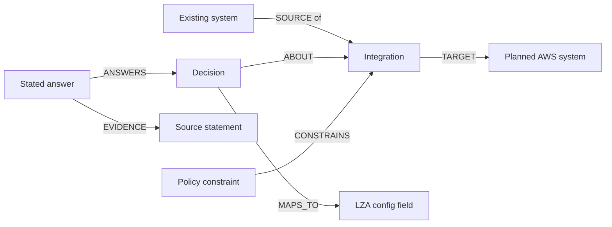

# Architecture ontology for the experiment

Design and implementation boundaries for the experiment. Optional GraphRAG
ingestion now adds sourced System and Candidate proposals linked by ABOUT and
CONNECTS_TO. Integration, Policy, and ConfigTarget nodes below remain design
ideas, not implemented features. Scope: understand the existing enterprise, decide how a new AWS
landing zone connects, and produce configuration for LZA 1.16.3. Existing
networks and identity systems are referenced, never provisioned by this tool.
`Policy` means a stated enterprise constraint. Open Policy Agent (OPA) evaluates
executable checks for supported constraints; it is not the enterprise policy itself.

## What exists today

Neo4j holds `Document`, `Statement`, `Fact`, and `Decision`. Answers link to source
statements; decisions have dependencies and applicability gates. Opt-in GraphRAG
adds unconfirmed System and Candidate nodes with source evidence. Only Fact nodes
answer catalog decisions; an extracted Candidate never closes a gap.

OPA checks generated configuration separately. Its bundled rules are example
controls, not evidence of bank approval. Discussion narration receives stated
values, source locations, findings, and the unconfirmed architecture projection.

## Small model

Keep the evidence model. Add four concepts, with stable IDs and explicit links:

| Concept | Minimum meaning | Example |
| --- | --- | --- |
| System | Name, kind, lifecycle: `existing` or `planned` | Existing hybrid network; existing Entra ID; planned AWS landing zone; planned AWS IAM Identity Center |
| Integration | Kind, source system, target system | Hybrid network to AWS; Entra ID to IAM Identity Center |
| Policy | Stated constraint, source, optional executable check reference | AWS data locations must be within the declared approved regions |
| ConfigTarget | LZA version, file, field path | LZA 1.16.3, `iam-config.yaml`, `identityCenter.identityCenterAssignments` |

`Decision` remains a question. `Fact` remains a stated answer, not an approval or
proof that an integration works. `Statement` supplies evidence for system
declarations and enterprise policies as well as decision answers. Config targets
and executable check references come from maintained code/schema mappings, not
from model guesses. A policy with no executable check is explicitly unassessed.

Decisions and policies can also reference a system directly. Preserve existing
`REQUIRES` and `GATED_BY` links between decisions. An integration needs a node
because several questions and constraints apply to the same connection.

## Concrete architecture slice

Use four systems and two integrations for the example; declarations must come
from the packet, never from an assumed enterprise reference architecture:

- `enterprise-network` (existing): the relevant on-premises, SD-WAN, and cloud
  network boundary, without inventorying its devices.
- `enterprise-identity` (existing): Entra ID in this example.
- `aws-landing-zone` (planned): the AWS environment configured through LZA.
- `aws-identity-center` (planned): its AWS access service.
- `hybrid-connectivity`: enterprise-network → aws-landing-zone.
- `workforce-access`: enterprise-identity → aws-identity-center.

For each integration, ask whether it is required. Then capture only connection
method, relevant address/routing/DNS decisions for networking, or federation,
provisioning, and group-to-account access decisions for identity. If it is not
required, retain the architect's reason. Do not silently infer applicability.

| Decision or constraint | Scope | Current output/check boundary |
| --- | --- | --- |
| Reserved AWS CIDR | AWS landing zone and hybrid connectivity | `network-config.yaml`: `vpcs[].cidrs`; existing private-CIDR check does not prove absence of enterprise overlap |
| Enterprise routing and DNS integration | Hybrid connectivity | Architecture context; current emitter does not implement the connection |
| Entra ID federation and provisioning | Workforce access | Architecture context; current emitter does not configure Entra ID or federation |
| Group, permission set, and account bindings | Workforce access | `iam-config.yaml`: `identityCenter.identityCenterAssignments` |
| Organization logging constraint | AWS landing zone | `global-config.yaml`: `logging.cloudtrail.organizationTrail`; checked by bundled OPA policy |

`ConfigTarget` records supported output fields, not a deployment engine. Give
unmapped decisions an explicit context-only boundary in review and trace. Do not
add fake configuration targets to make every architecture decision look automated.

## Only the essential questions

For the network connection, capture the existing network boundary, whether and
how AWS connects, the relevant address ranges, and the agreed routing and DNS
integration. Do not inventory every router or generate SD-WAN configuration.

For identity, capture the existing provider, the federation/provisioning approach,
and the groups mapped to AWS permission sets and accounts. Existing assignment
and policy-mapping decisions should be reused. Do not create Entra ID resources.

An architect must be able to state that an integration is not needed, with a
reason; its dependent questions then do not apply. Missing answers remain open
questions. Free text such as “TBD” must not count as a resolved connection decision.

Only map decisions that actually affect emitted LZA fields. Federation setup or
enterprise DNS changes may be outside the supported LZA output; record that
boundary instead of inventing a config field. File-level schema validity is
separate from architecture completeness and working connectivity.

## Policy and LLM boundaries

Keep policy meaning separate from enforcement. An enterprise constraint has
evidence and scope; a Python rule or OPA rule evaluates a specific supported
condition. Record the result with the configuration hash, check reference, and
coverage. A passing OPA check must not imply the entire architecture is compliant.
Keep executable logic in its existing rule implementation, not duplicated in the
ontology or generated by the LLM.

The current OPA entry point is `data.lza.deny`, which returns messages across
several controls. Do not present those messages as stable per-control identifiers.
The first implementation may link the policy file and query, retaining findings
and assessed scope. A missing check is unassessed, not compliant. The bundled
approved-region list is an example rule set, not a customer's residency policy.

Supply the LLM with a small structured view of the relevant systems, integrations,
stated values with source references, unresolved decisions, policy findings, and
supported LZA mappings. Exclude ambiguous or unusable answers from resolved
context. Retrieved source text is evidence, never an instruction to the model.

The LLM explains connections and suggests the next architectural questions using
those IDs. It does not invent systems, supply missing decisions, execute arbitrary
Cypher, change policy, or approve output. The architect updates the packet and
ingests it again; deterministic review remains the authority for findings.

The structured view should answer one practical chain: **which system or
integration is affected → what is stated and where → what remains undecided or
conflicting → which check and LZA field, if any, are affected**. Retrieve it through
fixed application queries. Keep proposed questions separate from recorded facts;
there is no LLM write-back to the graph. Include source/configuration hashes on
assessment results so an old policy result cannot describe a changed configuration.

## One workflow, two outputs

Capture the packet → review the architecture graph → discuss open questions →
update the packet → emit the supported LZA configuration.

Keep the LZA config files and a decision trace linking answers to source evidence
and affected fields. Consolidate useful content from `handoff.yaml` into review
and trace; do not add a separate handoff workflow. “Bundle” means only the output
directory. Platform-team extensibility is outside this experiment's scope.

## Smallest proof

Use one illustrative hybrid network, Entra ID, and planned AWS landing zone.
Show that missing connectivity or identity decisions produce specific questions
linked to the affected systems. An answered question must retain its evidence;
an applicable policy failure must identify its affected decision/config target.
The LLM must receive these relationships and values without resolving gaps itself.
The resulting LZA files must still pass the pinned schema checks. No real estate
discovery, deployment, or bank integration success is implied by this example.

## Functional milestone and usability

The purpose is a sourced architecture discussion, followed by configuration for a
known consumer. Graph size and the number of integrated frameworks are not goals.

Reuse schema-guided knowledge extraction and GraphRAG for discussion context.
Evaluate [Neo4j GraphRAG for Python](https://neo4j.com/docs/neo4j-graphrag-python/current/)
because Neo4j is already present; its knowledge graph builder is experimental.
The schema-guided extraction component is now integrated at version 1.21.0.
Neither it nor an alternative library replaces
applicability questions, OPA execution, architect decisions, or output validation.
Keep the confirmed decision graph authoritative; extracted candidates must not
overwrite it automatically.

Configuration export is deterministic mapping from accepted values to a known
input contract. LZA YAML and a reviewed input subset for community VPC module
6.7.3 are implemented. The module receives `terraform.tfvars.json` through
its root caller, with types and required inputs checked against the supplied
JSON Schema contract. Do not generate resource definitions or run Terraform. Module references
alone do not establish an export mapping; no arbitrary-module exporter is planned.

1. **Start locally.** Compose starts the application and Neo4j, with an explicit
   optional local model configuration. An example works without a host Python
   installation. The application image includes OPA and pinned LZA schemas;
   the LLM provider and model remain explicit.
2. **Load one client case.** Supply the client document alongside explicitly
   selected organisation reference files: LZA configuration/schema version,
   OPA policies and data, and relevant module documentation/input contracts.
   Distinguish stated client requirements from reference examples and policy
   constraints. A sample value is never a client decision. Keep a whole-case
   rebuild; reloading the document must not silently lose its reference context.
3. **Review and discuss.** Show known requirements with evidence, open questions,
   and conflicts with applicable rules. The LLM receives relevant facts and
   relationships, not merely answered keys. The architect records the answers.
4. **Export supported configuration.** Generate only fields with explicit,
   tested mappings to the chosen LZA version; show unsupported requirements in
   review and trace. Module ingestion supplies knowledge, not automatic support
   for generating or executing arbitrary modules.

Free-form extraction is now opt-in with `ingest --extract-model MODEL`, using
Neo4j GraphRAG and an explicit Ollama endpoint. This authorised ingestion mode
sends source statements to the model; default ingestion remains deterministic.
Architects confirm proposals by recording `decision: value` answers in the packet
and ingesting it again. One packet of up to 32,000 characters is supported without
embeddings or a vector index. There is no second graph of accepted decisions.

Missing information is found against the selected applicable questions and
constraints, not merely by converting text to a graph. Preserve uncertainty and
cite the requirement or selected rule that makes each question necessary.

Acceptance: a fresh checkout starts with Compose; one client case references an
existing hybrid network and Entra ID; one deliberately absent integration answer
and one organisation-policy conflict appear with evidence; corrected answers
produce schema-valid LZA configuration and a decision trace. No deployment or
general-purpose platform extension framework is part of this milestone.
