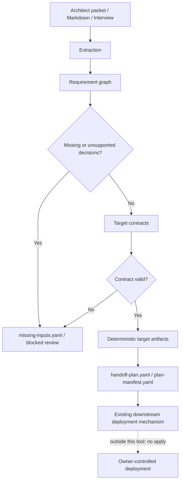

# iac-llm-wrapper

**Architect exchange to registered target configuration.**

Architects write messy design docs. `iac-llm-wrapper` is a pre-flight decision
capture and handoff-readiness layer: it extracts structured decisions, checks
them against requirement graphs and target contracts, and emits traceable target
configuration artifacts for engineers and existing deployment mechanisms.

The repository and package are named `iac-llm-wrapper`. The core is
**intent-engine**. Today it wraps LLM extraction with deterministic decision
validation and emits registered-target configuration artifacts. Direct
deployment, dashboards, and cloud changes stay downstream; the tool can say when
a bundle is ready for an existing deployment mechanism, but it does not invoke
that mechanism. It also does not generate whole IaC from scratch.

AWS Landing Zone Accelerator is the reference path and downstream authority:
collected and validated inputs become LZA YAML/config files consumed by the
owner-controlled LZA validation and deployment process.

## Core Flow



LLMs help read intent. Human-owned models, requirement graphs, contracts,
validators, lineage, runbooks, and evals decide what is acceptable. Existing
accelerators, modules, and provisioning pipelines remain the delivery layer.
This project is not an LZA replacement, LZA CLI wrapper, Terraform/NTC
alternative, or deployment pipeline.

## Five-Minute Local Run

Run a small local model path with Ollama and `uv`:

```bash
ollama pull qwen2.5:3b
ollama serve

uv venv
source .venv/bin/activate
uv pip install -e ".[dev]"

iac-llm-wrapper compile -i fixtures/usability/engineer-handoff-lza.md \
  -o out/engineer-handoff-lza \
  --pattern aws-lza --provider ollama --model qwen2.5:3b

iac-llm-wrapper review html --input out/engineer-handoff-lza \
  --output out/engineer-handoff-lza/handoff-review.html
```

The output is a reviewed handoff bundle: decision report, trace summary,
contract-backed LZA config files, lineage, runbook, sample recommendations, and a
portable HTML review page.

For Bedrock/OpenAI options and model-quality workflows, see
[docs/LLM_SETUP.md](docs/LLM_SETUP.md). For emitted file meanings, see
[docs/ARTIFACTS.md](docs/ARTIFACTS.md).

## Choose Your Path

| Need | Start here |
| --- | --- |
| Contribute safely | [CONTRIBUTING.md](CONTRIBUTING.md) |
| Understand the core flow | [docs/ARCHITECTURE.md](docs/ARCHITECTURE.md) |
| Understand emitted files | [docs/ARTIFACTS.md](docs/ARTIFACTS.md) |
| Add or change a pattern | [docs/PATTERN_AUTHORING.md](docs/PATTERN_AUTHORING.md) and [docs/EXTENSION.md](docs/EXTENSION.md) |
| Keep LLM context reviewable | [docs/CONTEXT_AS_CODE.md](docs/CONTEXT_AS_CODE.md) |
| Tune or compare LLMs | [docs/LLM_SETUP.md](docs/LLM_SETUP.md) |
| Understand LZA ecosystem positioning | [docs/LZA_RELATED_WORK_STRATEGY.md](docs/LZA_RELATED_WORK_STRATEGY.md) |
| Give downstream AWS LZA feedback | [docs/LZA_DOWNSTREAM_VALIDATION.md](docs/LZA_DOWNSTREAM_VALIDATION.md) |
| Check shared terminology | [docs/GLOSSARY.md](docs/GLOSSARY.md) |
| Visualize graphs and results | [docs/DEVELOPER_VISUALS.md](docs/DEVELOPER_VISUALS.md) |

## Patterns

Patterns define questions, defaults, contracts, validators, and output files.
Recommended product paths stay thin and contract-backed:

| Pattern | Description |
| --- | --- |
| `aws-lza` | Contract-backed AWS Landing Zone Accelerator registered-target configuration using official-style LZA YAML artifacts |
| `cloudformation-parameters` | BYOM CloudFormation parameter handoff for an existing template |
| `kubernetes-cluster` | Kubernetes cluster handoff with optional Terraform EKS module input references |
| `terraform-vpc` | BYOM Terraform AWS VPC module input capture |

## Why Not Terraform, CDK, Or CloudFormation?

Those tools provision infrastructure. This tool captures and validates the
decisions that must be made before provisioning. Today it emits deterministic
target configuration artifacts engineers use with existing accelerators, sample
configurations, and IaC modules. AWS LZA YAML is the canonical example: the tool
can assemble validated config files for the registered target, but the LZA
deployment process remains downstream.

## Project Status

Alpha. Core architecture is stable. Pattern library is growing. Contributions
welcome.

## License

Apache 2.0
