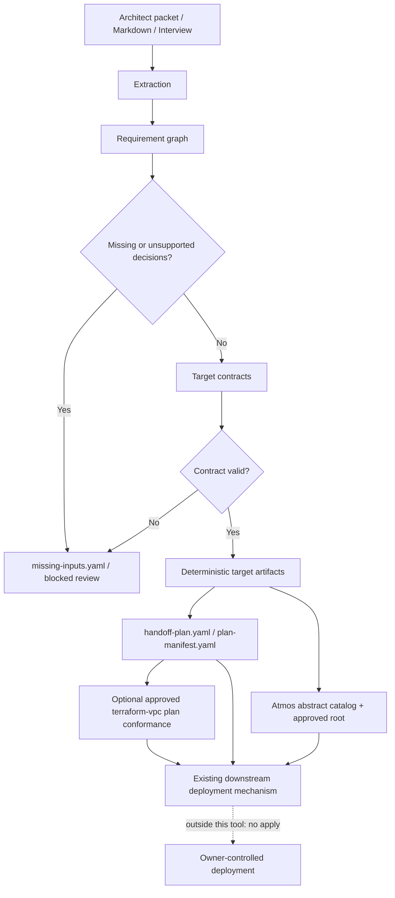

# iac-llm-wrapper

**Architect exchange to registered target configuration.**

Architects write messy design docs. `iac-llm-wrapper` is a pre-flight decision
capture and handoff-readiness layer: it extracts structured decisions, checks
them against requirement graphs and target contracts, and emits traceable target
configuration artifacts for engineers and existing deployment mechanisms.

The repository and package retain the historical name `iac-llm-wrapper`. The
product is a **requirements-to-target handoff compiler** and its core is
**intent-engine**. An LLM is an optional conversational adapter; deterministic
decision validation and registered-target contracts remain authoritative, and
the compiler emits registered-target configuration artifacts. Direct
deployment, dashboards, and cloud changes stay downstream; the tool can say when
a bundle is ready for an existing deployment mechanism. The single
`terraform-vpc` conformance path may invoke an exact code-owned module for a
temporary speculative plan and compare plan-observable values with accepted
requirements; it cannot apply, retain state, or generate whole IaC from scratch.
Outside that fixed adapter, the product does not generate whole IaC from scratch.

AWS Landing Zone Accelerator is the reference path and downstream authority:
collected and validated inputs become LZA YAML/config files consumed by the
owner-controlled LZA validation and deployment process.

## Broader Goal

The broader goal is a model-agnostic, contract-first handoff layer for approved
accelerators, IaC modules, and platform pipelines. It should turn
architect/platform/engineer preferences into requirement graphs, target
contracts, sample alignment, review evidence, and manual gates.

CI/CD, including GitHub Actions, should consume those bundles as shift-left
checks: validate decisions, compare changes, prove contract readiness, and route
reviewed configuration into owner-controlled deployment paths for existing or
greenfield environments. Deployment still belongs to those downstream
mechanisms; the core should not become the deploy runner.

For smaller workload practice, the `terraform-vpc` pattern captures inputs for
the pinned `terraform-aws-modules/vpc/aws` `6.6.1` module in an existing AWS
account, including the owner-controlled deployment pipeline reference. Its
approved adapter pins Terraform `1.15.8`, AWS provider `6.53.0`, and the reviewed
module `6.6.1` source tree, verifies bundle replay identities, and emits
sanitized account-bound requirement-to-plan conformance evidence. The policy
pack remains mapping metadata; the target-local Python evaluator owns these
comparisons. Git-aware incremental runs use
`compile-git` to rebuild only bundles whose design docs changed. Optional
Checkov evidence can be captured with `shift-left checkov` against an
owner-provided IaC/module path; generated `terraform.tfvars` alone is not treated
as meaningful policy coverage. Regulated patterns can also declare policy graph
metadata that maps client/platform controls, framework labels such as SOC 2,
PCI, HIPAA, and NIST, target contracts, module variables, and owner Checkov
policy references. That evidence is shift-left input for owner CI/CD gates, not
compliance attestation or deployment approval.

Every successful `terraform-vpc` compile also emits a self-hosted Atmos bridge:
an abstract `terraform-vpc/intent-defaults` catalog component plus a byte-for-byte
copy of the approved Terraform root and provider lockfile. The catalog contains
only replay-bound Terraform variables. It intentionally contains no backend,
workspace, credentials, roles, environment, secrets, owner stack name, or apply
configuration. Owners import the artifacts, create a real named component that
inherits the abstract defaults, add runtime controls in their repository, and
open a reviewed PR. Atmos is validated in CI with a checksum-pinned OSS binary;
it is not a Python or runtime dependency of this package.

## Core Flow



LLMs may help read intent. Human-owned models, requirement graphs, contracts,
validators, lineage, runbooks, and evals decide what is acceptable. Existing
accelerators, modules, and provisioning pipelines remain the delivery layer.
This project is not an LZA replacement, LZA CLI wrapper, Terraform/NTC
alternative, or deployment pipeline.

The repository owns the path from architecture exchange to validated intent,
then to native target artifacts, an evidence sidecar, and a PR-ready handoff.
The owner creates the PR and owns every later transition: orchestration, state,
policy, approval, apply, drift, and audit.

## Five-Minute Local Run

Run a small local model path with Ollama and `uv`:

```bash
ollama pull qwen2.5:3b
ollama serve

uv sync --locked --extra dev

iac-llm-wrapper compile -i fixtures/usability/engineer-handoff-lza.md \
  -o out/engineer-handoff-lza \
  --pattern aws-lza --provider ollama --model qwen2.5:3b

iac-llm-wrapper review html --input out/engineer-handoff-lza \
  --output out/engineer-handoff-lza/handoff-review.html
```

The supported uv version is declared once in `pyproject.toml`. Install that
version before running the locked commands.

The output is a reviewed handoff bundle: decision report, trace summary,
contract-backed LZA config files, lineage, runbook, sample recommendations, and a
portable HTML review page.

For Bedrock/OpenAI options and model-quality workflows, see
[docs/LLM_SETUP.md](docs/LLM_SETUP.md). For emitted file meanings, see
[docs/ARTIFACTS.md](docs/ARTIFACTS.md).

## Choose Your Path

| Need | Start here |
| --- | --- |
| Contribute safely | [CONTRIBUTING.md](CONTRIBUTING.md) |
| Understand the core flow | [docs/ARCHITECTURE.md](docs/ARCHITECTURE.md) |
| Understand emitted files | [docs/ARTIFACTS.md](docs/ARTIFACTS.md) |
| Add or change a pattern | [docs/PATTERN_AUTHORING.md](docs/PATTERN_AUTHORING.md) and [docs/EXTENSION.md](docs/EXTENSION.md) |
| Keep LLM context reviewable | [docs/CONTEXT_AS_CODE.md](docs/CONTEXT_AS_CODE.md) |
| Tune or compare LLMs | [docs/LLM_SETUP.md](docs/LLM_SETUP.md) |
| Understand LZA ecosystem positioning | [docs/LZA_RELATED_WORK_STRATEGY.md](docs/LZA_RELATED_WORK_STRATEGY.md) |
| Give downstream AWS LZA feedback | [docs/LZA_DOWNSTREAM_VALIDATION.md](docs/LZA_DOWNSTREAM_VALIDATION.md) |
| Check shared terminology | [docs/GLOSSARY.md](docs/GLOSSARY.md) |
| Visualize graphs and results | [docs/DEVELOPER_VISUALS.md](docs/DEVELOPER_VISUALS.md) |

AWS LZA users with a local LZA checkout and installed development toolchain can
also run validation-only evidence capture:

```bash
iac-llm-wrapper lza validate \
  --bundle out/engineer-handoff-lza \
  --lza-source /path/to/landing-zone-accelerator-on-aws
```

This runs only the official LZA config validator and writes
`lza-validation-evidence.yaml`; it does not synth, deploy, clone, install, or
mutate AWS. Depending on the AWS LZA version and local validation path, the
official validator may perform read-only AWS account lookup through your
configured AWS/LZA context.

For a requirement-complete `terraform-vpc` bundle, use standard AWS environment
or profile credentials for the declared non-production account:

```bash
iac-llm-wrapper terraform plan --bundle out/terraform-vpc
```

The command verifies contracts, replay hashes, the initialized module tree, and
Terraform `1.15.8`; then it runs locked validate/plan/show in a temporary local
workspace and writes `terraform-plan-evidence.yaml` v2. Every applicable graph
requirement and registered control receives a terminal outcome. Known
contradictions, unknown or sensitive required values, incomplete plans,
untraceable resources, account mismatches, and delete/replace actions fail
closed. A normal passing result is `conformant-with-deferred-gates` because
pipeline ownership, organizational IPAM approval, and downstream attachment
checks require independent owner evidence.

The operator must supply owner-approved restricted credentials. The core checks
the observed account identity but cannot prove the credential permission scope.
It never invokes `apply` or `destroy`, owns a backend, keeps state, retains the
binary plan/raw plan JSON, or records credentials. The owner pipeline must
re-plan against its real backend before any future apply. Synthetic fixtures and
credential-free module/root CI prove the local boundary; a real owner-account
acceptance run remains separate and authorization-gated.

### Atmos owner handoff

For `terraform-vpc`, copy or import these generated paths into an owner Atmos
repository:

- `atmos/stacks/catalog/terraform-vpc-intent.yaml`
- `atmos/components/terraform/terraform-vpc/`

Create a real owner-named component whose `metadata.inherits` contains
`terraform-vpc/intent-defaults`. Configure backend, authentication, workspace,
approval, and environment details only in the owner repository. Use
`atmos validate stacks` and `atmos describe component ... --provenance` in the
reviewed PR, then let Atlantis or another owner-controlled OSS pipeline create a
fresh downstream plan. The generated component is abstract, and this repository
does not provide an apply command.

### Optional OSS consumers

The integration protocol is Git plus contract-backed artifacts, not service
APIs. These projects are optional downstream choices:

- [Backstage](https://backstage.io/) may collect known inputs, invoke the existing
  CLI, and commit its output; it does not replace decision discovery or evidence.
- [Atlantis](https://www.runatlantis.io/) may execute the owner repository's Atmos
  workflow and approval rules through an owner-defined custom workflow; no API
  integration belongs here.
- [AWS Control Tower AFT](https://docs.aws.amazon.com/controltower/latest/userguide/aft-provision-account.html)
  is the next configuration-only target candidate, not an implementation. It
  requires an owner AFT repository contract, explicit account and SSO inputs,
  approved email-data handling, one real account request, and repeat use first.
- [cfn-lint](https://github.com/aws-cloudformation/cfn-lint) and
  [cfn-guard](https://github.com/aws-cloudformation/cloudformation-guard) are the
  smallest possible enhancement to `cloudformation-parameters` when an owner
  provides the approved template and rules. Parameter contracts remain this
  project's responsibility.
- [Terragrunt](https://terragrunt.gruntwork.io/) remains an alternative
  Terraform orchestration target. Terramate is deferred because another bridge
  would duplicate the still-unproven Atmos workflow.
- [Score](https://score.dev/) and [Crossplane](https://www.crossplane.io/) need
  separate owner contracts and real use cases before implementation; Crossplane
  additionally requires the exact organization-owned XRD and Composition.
- The [AWS IaC MCP server](https://github.com/awslabs/mcp/tree/main/src/aws-iac-mcp-server)
  may expose CloudFormation validation conversationally, but remains optional
  and non-authoritative.

No Backstage portal, Atlantis API, MCP server, second orchestration adapter, or
new LLM provider belongs in this slice. Add one only after an owner uses the
Atmos bundle in a PR, repeats the workflow, and demonstrates a material review
benefit. Remove the bridge if official schemas/forms produce the same practical
result, reviewers ignore its evidence, or nobody repeats the workflow. A future
target that needs another large bespoke semantic evaluator stays
configuration-only unless a genuinely shared protocol has been proven.

## Patterns

Patterns define questions, defaults, contracts, validators, and output files.
Recommended product paths stay thin and contract-backed:

| Pattern | Description |
| --- | --- |
| `aws-lza` | Contract-backed AWS Landing Zone Accelerator registered-target configuration using official-style LZA YAML artifacts |
| `cloudformation-parameters` | BYOM CloudFormation parameter handoff for an existing template |
| `kubernetes-cluster` | Kubernetes cluster handoff with optional Terraform EKS module input references |
| `terraform-vpc` | Exact approved Terraform AWS VPC module input capture, abstract Atmos handoff, and account-bound requirement-to-plan conformance |

## Why Not Terraform, CDK, Or CloudFormation?

Those tools provision infrastructure. This tool captures and validates the
decisions that must be made before provisioning. It emits deterministic target
configuration artifacts engineers use with existing accelerators, sample
configurations, and IaC modules. The narrow Terraform VPC adapter establishes
only that one exact speculative plan matches the requirements observable at plan
time, with named deferred gates; it is not an apply path or a general IaC
generator. AWS LZA remains configuration-only and
the downstream LZA deployment process remains authoritative.

## Project Status

Alpha. Core architecture is stable. Pattern library is growing. Contributions
welcome.

## License

Apache 2.0
